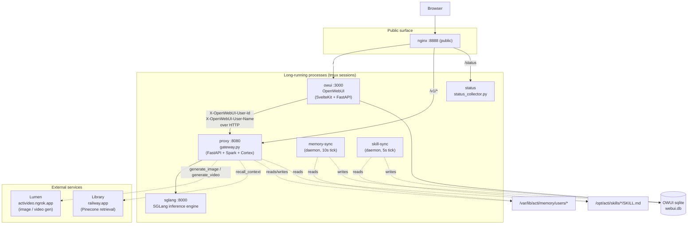
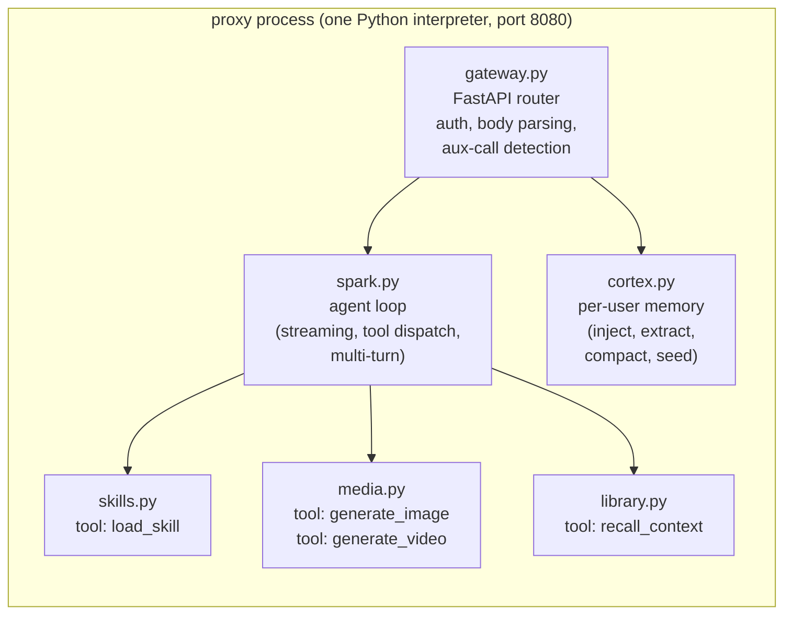
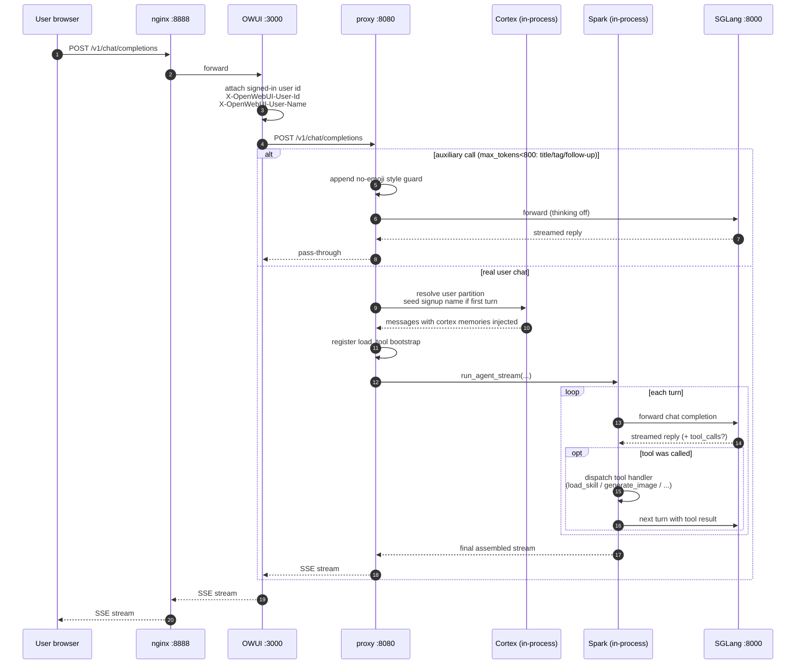
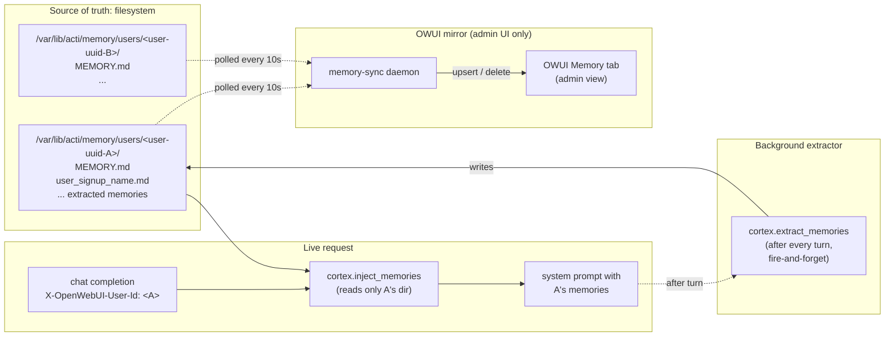
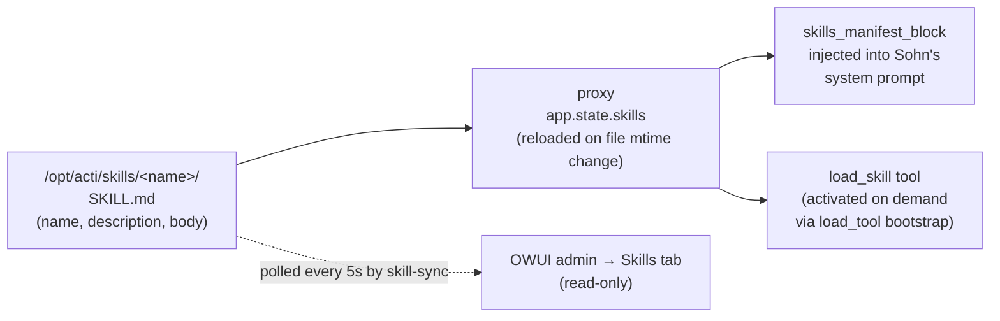

# ACTi Backend — How It Actually Runs

A concrete walk-through of every process, port, and data flow on a live ACTi pod. This is the "operator's mental model" — what's a separate process, what's a library inside another process, and where the actual data lives.

---

## TL;DR

There are **6 long-running processes** on the pod (each in its own tmux session) plus **nginx** out front. Two of them — **Spark** and **Cortex** — are *not* separate processes; they're Python modules that live *inside* the proxy. The two `*-sync` daemons are filesystem-to-OWUI mirrors and stay separate because they have nothing to do with the agent loop — they're pure ETL on a polling timer.



---

## The processes (1-by-1)

| tmux | Listens on | What it does | Started by |
|---|---|---|---|
| `sglang` | `127.0.0.1:8000` | SGLang inference engine. Serves the Sohn model. Holds the GPU. | `/root/sohn/launch_sglang.sh` |
| `proxy` | `0.0.0.0:8080` | OpenAI-compatible HTTP front door. Hosts Spark (agent loop) and Cortex (memory) as in-process modules. Owns all tool dispatch (`load_skill`, `generate_image`, `generate_video`, `recall_context`). | `/root/sohn/launch_proxy.sh` |
| `owui` | `127.0.0.1:3000` | OpenWebUI fork (`vendor/acti-ui`). Chat UI + auth + chat history DB. Forwards every chat to `127.0.0.1:8080/v1/chat/completions` with the user's identity headers. | `/root/sohn/launch_owui.sh` |
| `memory-sync` | (no port) | Mirrors cortex memory files into OWUI's `memory` SQLite table so admins can see them in the UI. 10-second polling loop. Pure ETL — does not call the model. | `/opt/acti/memories/launch_memory_sync.sh` |
| `skill-sync` | (no port) | Mirrors `/opt/acti/skills/*/SKILL.md` into OWUI's `skill` SQLite table so admins can see/manage them in the OWUI admin panel. 5-second polling loop. Pure ETL — does not call the model. | `/opt/acti/skills/launch_skill_sync.sh` |
| `status` | (no port) | `status_collector.py` polls all the other processes every 30s and writes `status_history.json` for the public `/status` page. | `/root/sohn/launch_status.sh` |

And nginx, running as a systemd service (not tmux), terminates the public port and routes by path.

---

## What's INSIDE the proxy process

This is the part that's easy to misread. The proxy is **one Python process** running `gateway.py`. Inside that single process:



These are **import statements**, not service boundaries. `from spark import run_agent_stream` — that's the entire integration. If you `kill` the proxy, Spark and Cortex die with it because they're the same OS process.

### So why ARE memory-sync and skill-sync separate?

Three reasons:

1. **Different lifecycle.** The proxy needs to handle every request with sub-second latency. The sync daemons run on a polling timer (5–10 seconds) and are happy to block on SQLite or filesystem walks. Mixing those two duty cycles in one event loop just means worse tail latency on requests.

2. **Different failure mode.** If memory-sync crashes, the proxy keeps serving — users see no impact, only the admin's "Memory" tab in OWUI gets stale. If we put memory-sync inside the proxy, a SQLite lock or schema-mismatch bug would take chat down with it.

3. **Different identity.** The sync daemons write to OWUI's database, which OWUI also writes to. They live "next to" OWUI more than next to the proxy. The fact that the source data (memory files, skill files) is also read by the proxy is a coincidence of the source-of-truth being filesystem-based.

A useful framing: **Spark and Cortex are libraries the proxy imports**. The `*-sync` daemons are **standalone integrations** between two databases (filesystem and OWUI sqlite). They're not "under" Spark because they aren't part of the agent loop at all.

---

## Request lifecycle (a single chat turn)



The two big branches here are the **auxiliary path** (OWUI's title/tag/follow-up generation — small token budget, no Sohn persona, no tools, no memory) and the **real chat path** (full Spark + Cortex pipeline). They diverge at `_is_auxiliary_call(body)` in `gateway.py` — the threshold is `max_tokens < 800`.

---

## Memory data flow

This is the part the recent fix changed the most. Before per-user partitioning, the leftmost box was a single global directory whose contents were injected into every user's chat.



Two key invariants:
- **Cortex never reads another user's directory.** Partitioning is by sanitized `X-OpenWebUI-User-Id`. There's no code path that crosses partitions.
- **Filesystem is canonical.** OWUI's memory table is a downstream view that the daemon rebuilds from the filesystem. Deleting a memory file → daemon notices → row is deleted from OWUI. The proxy never reads from OWUI's memory table.

---

## Skill data flow

Skills are domain knowledge packages that the model can request via the `load_skill` tool. The flow looks like this:



The model sees `name + description` in the system prompt; calling `load_skill(name="X")` returns the full body of `X/SKILL.md` for that turn only. OWUI just gets a read-only mirror in the admin panel for visibility — it doesn't actually run skills.

---

## External services

Two third-party services the proxy talks to. Both are gated by env vars at the proxy launcher; if the URL or token isn't set, the corresponding tool is unregistered.

| Service | URL | Purpose | Tool name |
|---|---|---|---|
| Lumen | `https://activideo.ngrok.app` | image and video generation | `generate_image`, `generate_video` |
| Library | `https://acti-retrieval-production.up.railway.app` | Pinecone-backed retrieval over the Unblinded corpus | `recall_context` |

Both bearer tokens stay server-side (`/etc/acti/media.env`, `/etc/acti/library.env`) and are never sent to the model or the client.

---

## Where state lives

| State | Location | Owner |
|---|---|---|
| Per-user memories | `/var/lib/acti/memory/users/<uuid>/*.md` | Cortex (proxy) |
| Skills | `/opt/acti/skills/<name>/SKILL.md` | filesystem; loaded by proxy |
| OWUI users, chats, tags | `/var/lib/acti/openwebui/webui.db` | OWUI |
| OWUI memory mirror | same DB, `memory` table | written by `memory-sync`, read by OWUI |
| OWUI skill mirror | same DB, `skill` table | written by `skill-sync`, read by OWUI |
| Vector embeddings (Chroma) | `/var/lib/acti/openwebui/vector_db/chroma.sqlite3` | OWUI (currently empty — no RAG configured) |
| API keys | `/root/sohn/api-keys.txt` | proxy |
| System prompt | `/root/sohn/sohn_system_prompt.txt` | proxy reads at boot |
| Status page JSON | `/usr/share/nginx/html/acti-status/status_history.json` | status_collector |
| Logs | `/var/log/acti/*.log`, `/root/sohn/*.log` | per-process |

---

## What's redundant after the per-user partition fix

A handful of things are now load-bearing on a model that no longer applies. Worth a cleanup pass at some point:

1. **`memory-sync`** is currently mirroring nothing useful. Its target — OWUI's per-user `memory` table — is filtered by user_id, but with cortex now writing per-user files under `users/<id>/`, the daemon's flat `glob('*.md')` walk only finds files at the root, which is now empty by design. The daemon idles harmlessly. Fix is either (a) update the daemon to walk per-user dirs and assign each row to the matching user, or (b) retire the daemon entirely since OWUI's memory feature is no longer the canonical view.

2. **OWUI's native memory feature** (the "Memory" tab in user settings) is duplicate functionality — the cortex pipeline already injects memories on every request. Recommend: keep OWUI memory disabled in user settings, since cortex is authoritative.

3. **The `_anonymous` partition** is shared across all direct API users without an OWUI session. Acceptable for operator API keys but worth flagging in operational docs.

---

## Quick operator commands

```bash
# Inspect what's running
tmux ls

# Tail any service
tmux attach -t proxy   # detach with Ctrl-b d

# Restart only the proxy
tmux kill-session -t proxy
tmux new-session -d -s proxy -c /root/sohn 'bash /root/sohn/launch_proxy.sh'

# Restart only OWUI (picks up env-var changes)
tmux kill-session -t owui
tmux new-session -d -s owui -c /root/sohn 'bash /root/sohn/launch_owui.sh'

# Health check the full stack
curl -s http://127.0.0.1:8080/health
curl -s http://127.0.0.1:3000/api/version

# See what user partitions exist
ls /var/lib/acti/memory/users/

# What's in user X's partition
cat /var/lib/acti/memory/users/<uuid>/MEMORY.md
```
